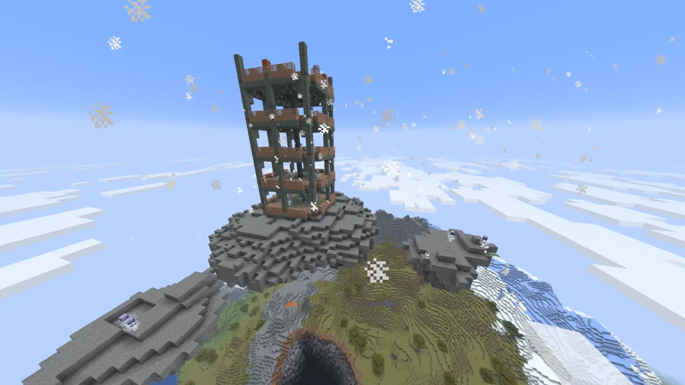
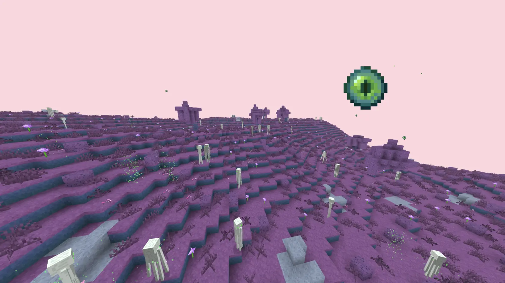
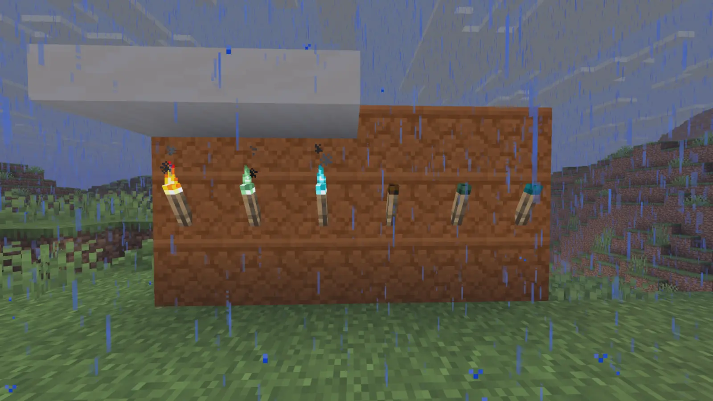

# Retold

[](https://github.com/xefensor/Retold/actions/workflows/build.yml)
[](https://github.com/xefensor/Retold/releases/latest)

Retold is an experimental NeoForge mod that reimagines Minecraft survival as an alternative evolution of the 1.0 era. Dimensions, progression, structures, mobs, recipes, and world rules are rebuilt around one connected history and a world that reacts to what the player does.

Retold is independently developed and is not an official Minecraft product or source of official Minecraft lore.

**[Modrinth](https://modrinth.com/mod/retold)** · **[CurseForge](https://www.curseforge.com/minecraft/mc-mods/retold)** · **[Discord](https://discord.gg/S3g98zEY8a)** · **[Issues](https://github.com/xefensor/Retold/issues/new/choose)**

> Retold is in active development and is not feature-complete. Back up important worlds before testing new releases.

## What Retold Changes

- **Connected progression:** defeating the Ender Dragon changes the world instead of ending the game.
- **Element paths:** Water and Air currently lead through the ocean monument and Air Temple; Fire and Earth are planned.
- **The Aender:** a bright, unstable late-game dimension that replaces normal survival End progression after the dragon egg ritual.
- **Living mobs:** hunger, homes, ranges, factions, territory, hunting, fleeing, warnings, and group behavior.
- **Discovery-first crafting:** recipe knowledge and villager teaching replace a recipe-book-first experience.
- **Reactive world rules:** later stages change undead, piglins, structures, portals, and other parts of the world.

## Screenshots

| Air Temple | Aender | Extinguished torches |
| --- | --- | --- |
|  |  |  |

The Aender screenshot includes AI-generated placeholder textures that are planned to be replaced with original artwork.

## Requirements And Installation

| Component | Current release target |
| --- | --- |
| Retold | `0.2.0` |
| Minecraft | `26.2` |
| NeoForge | `26.2.0.7-beta` |
| Java | `25` |
| Environment | Client and server; required on both |

1. Install the supported NeoForge version.
2. Download Retold from [Modrinth](https://modrinth.com/mod/retold), [CurseForge](https://www.curseforge.com/minecraft/mc-mods/retold), or [GitHub Releases](https://github.com/xefensor/Retold/releases).
3. Place the unmodified JAR in the instance's `mods` folder.
4. For multiplayer, install the same version on the server and every client.
5. Back up existing worlds before updating.

Only the locations linked above are official downloads. Version settings are defined in [`gradle.properties`](gradle.properties).

## Current Status

The current build includes the survival spine, Water and Air progression, staged world changes, Aender foundations, recipe discovery, and the Retold mob-behavior framework. Major unfinished areas include:

- natural Air Temple discovery and further Gale Core tuning
- Fire and Earth element paths
- original replacements for provisional Aender assets and naming
- Aender travel networks and late-game rewards
- broader progression, combat, village, and world-generation work
- wider fresh-world, upgraded-world, server, and multiplayer verification

See [`ROADMAP.md`](ROADMAP.md) for priorities and [`CHANGELOG.md`](CHANGELOG.md) for released changes.

## Quality And AI-Assisted Development

Retold uses AI-assisted development openly. The developer remains responsible for design decisions and accepted code. AI output is reviewed and is expected to pass the Gradle build, automated tests, NeoForge GameTests, and relevant in-game testing; compilation alone is not treated as proof of correctness.

Some systems still need broader real-world validation, especially dimension travel, regeneration, multiplayer behavior, and existing-world progression. Reproducible problems belong in [GitHub Issues](https://github.com/xefensor/Retold/issues/new/choose). Testing expectations are documented in [`CONTRIBUTING.md`](CONTRIBUTING.md).

## Documentation

- [`docs/README.md`](docs/README.md) — documentation index
- [`docs/design-overview.md`](docs/design-overview.md) — world and gameplay design
- [`ROADMAP.md`](ROADMAP.md) — public Now / Next / Later roadmap
- [`docs/internal/README.md`](docs/internal/README.md) — developer and technical documentation
- [`docs/internal/retold_mod_system.md`](docs/internal/retold_mod_system.md) — implementation architecture
- [`docs/internal/retold_mob_ai_system.md`](docs/internal/retold_mob_ai_system.md) — mob-AI architecture

## Development

```bash
./gradlew build
./gradlew runClient
./gradlew runServer
./gradlew runGameTestServer
./gradlew runData
```

Read [`CONTRIBUTING.md`](CONTRIBUTING.md) before submitting changes.

## Community, Credits And License

- Main developer: **Xefensor** — [alex@alexejtusl.cz](mailto:alex@alexejtusl.cz)
- Community and support: [Retold Discord](https://discord.gg/S3g98zEY8a)
- Bugs and suggestions: [GitHub Issues](https://github.com/xefensor/Retold/issues/new/choose)
- **Jesse Schramm** created the extinguished-torch textures.
- Asset attribution and placeholder status: [`ASSET_CREDITS.md`](ASSET_CREDITS.md)

Code and non-asset material use the [MIT License](LICENSE-CODE.md). Textures, audio, models, and other creative assets use the [Retold Asset License](LICENSE-ASSETS.md) and are All Rights Reserved. Complete, unmodified Retold JARs may be redistributed in modpacks under the asset-license conditions. See [`LICENSE`](LICENSE) for the exact boundary.
